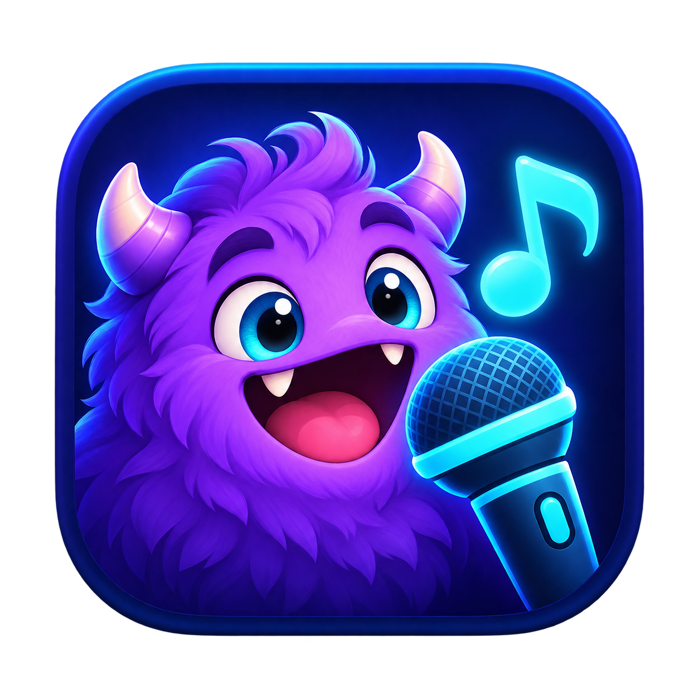
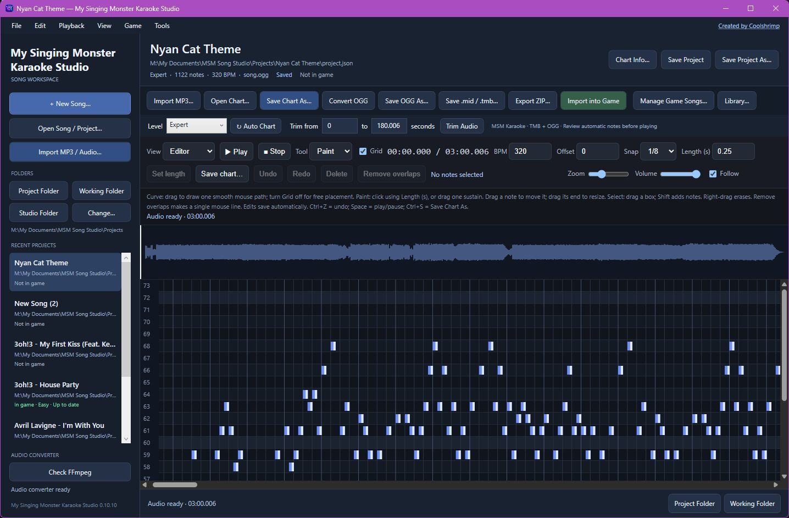
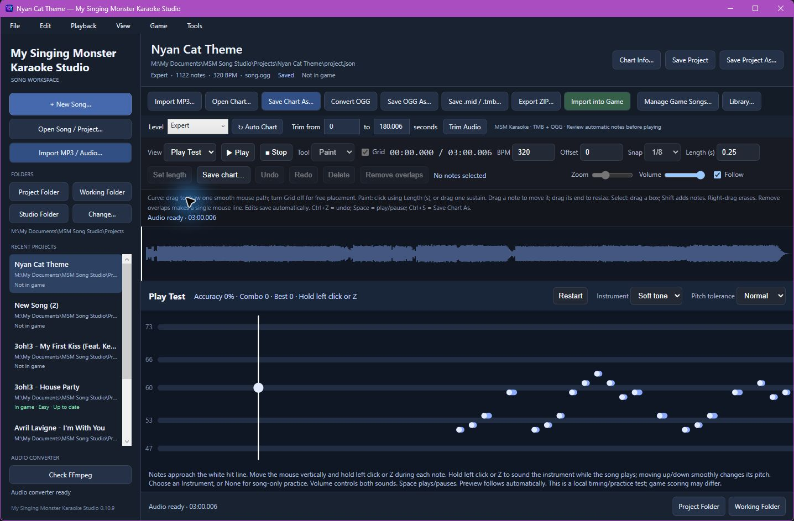
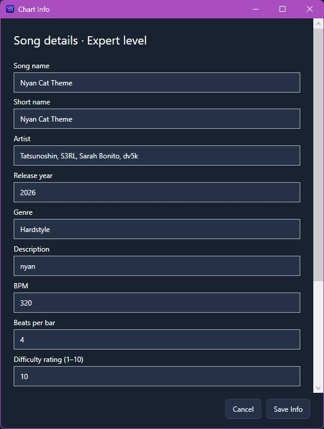
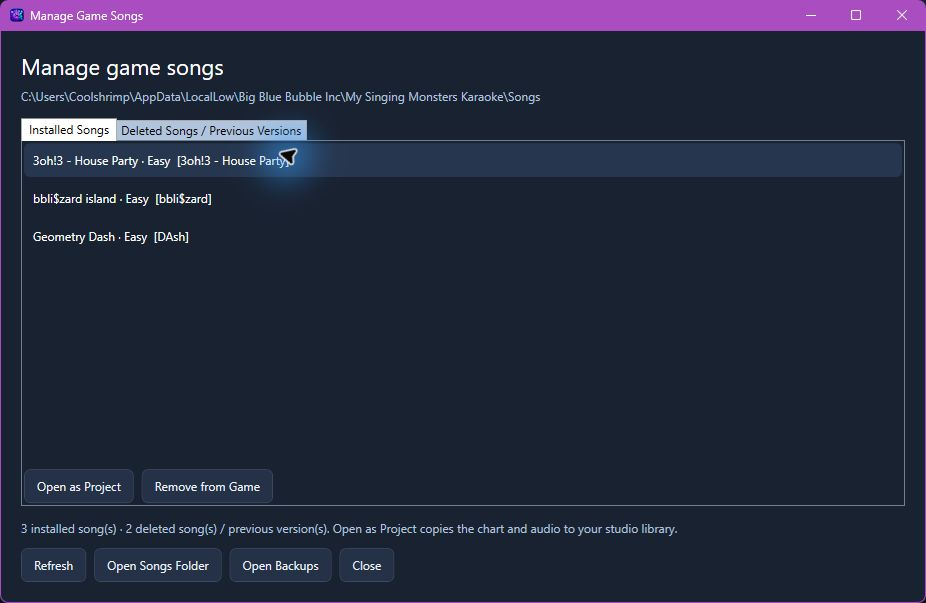

<p align="center"></p>

# My Singing Monster Karaoke Studio

**Turn an audio track into an editable mouse rhythm chart, test it with music, and export or import the finished song into My Singing Monsters Karaoke.**

Version **0.10.14** · Windows x64 · .NET 8 / WPF · embedded WebView2 editor

Created by [Coolshrimp](https://coolshrimpmodz.com/). The app also provides this link in the top navigation bar.

The studio brings audio conversion, automatic chart drafts, freehand note editing, song metadata, online downloads and game-song management into one desktop workspace. Start with your own MP3, open a downloaded chart package, or bring an installed game song back into the editor.

```text
Import audio → trim if needed → review the automatic chart → edit and play test
             → export matching OGG + TMB files as ZIP, or Import into Game
```

The editor uses web technology inside a Windows application. This release is a desktop app; it does not run as a standalone website.

## Screenshots

**Song workspace and chart editor** — waveform playback, note design, difficulty selection, exports and game sync in one view.



<details>
<summary>See Play Test, Chart Info and the game-song manager</summary>

**Play Test** — follow the notes with the mouse and choose an instrument for timing practice.



**Chart Info** — configure song metadata, tempo and difficulty before sharing or importing.



**Manage Game Songs** — open installed songs as projects and manage deleted songs or previous versions.



</details>

Workspace screenshot: **0.10.10**; other views: **0.10.9**. Screenshot files are kept in [snapshots/](snapshots/).

## Download and start

Download the Windows x64 EXE or portable ZIP from [GitHub Releases](https://github.com/coolshrimp/My-Singing-Monster-Karaoke-Studio/releases/latest). The ZIP includes the app, this guide and the one-click FFmpeg setup shortcut.

1. Extract the portable ZIP into a normal folder, then open `MySingingMonsterKaraokeStudio.exe`. The standalone EXE can also be run directly.
2. Make sure [Microsoft Edge WebView2 Runtime](https://developer.microsoft.com/en-us/microsoft-edge/webview2/) is installed. It supplies the embedded editor and online library.
3. Click **Install FFmpeg** in the studio, or run `install-ffmpeg.cmd` next to the app. The converter is downloaded and checksum-verified on first setup, then reused.
4. Choose **Import MP3 / Audio…** or **Open Song / Project…** to begin.

The release includes .NET, so users do not need to install the .NET SDK or runtime. FFmpeg is **not bundled** with the app. The compressed EXE is approximately 74 MB; the separately installed converter uses additional disk space. Internet is needed for first-time converter setup and online downloads, while local editing works offline after setup.

## Features

| Area | What you can do |
| --- | --- |
| Audio workspace | Import MP3 and other supported audio, view its real waveform, play/pause, seek by clicking the waveform, adjust volume and follow the playhead. |
| Conversion and trimming | Convert to OGG, save OGG to a chosen location, and drag waveform start/end handles or enter times, then clip to a separate OGG while keeping the original source unchanged. |
| Automatic charts | Create Easy, Normal, Hard and Expert drafts from audio pitch and onset analysis. Regenerate the selected level with **Auto Chart**, keeping the other levels. |
| Note design | Paint individual notes or sustained notes, draw smooth pitch curves, move notes, resize their ends, select several notes with a box, and erase continuously with right-drag. |
| Editing controls | Toggle the grid, choose timing snap and note length, zoom, delete selections, undo/redo, and remove overlaps for a single mouse-controlled path. |
| Chart information | Set title, short name, artist, release year, genre, description, BPM, beats per bar, per-level difficulty rating, note spacing and start/end colors. |
| Preview and practice | Switch from Editor to Preview or Play Test, follow notes with the mouse, hear a variable-pitch instrument and check timing, accuracy and combo. |
| Instrument sounds | Choose Soft tone, Flute, Brass, Organ, Chiptune or None in Play Test. |
| Projects and history | Autosave working edits, save a separate project, reopen with audio and notes restored, and manage a recent-project list. |
| File exports | Save charts, export MIDI or TMB, save OGG, and export a ZIP containing matching song-named audio/chart files. |
| Game integration | Import/update the selected level directly, compare installed content with the project, and show colored sync status. |
| Game library management | View installed songs, open a game song as a new project, remove it into backup, and restore or permanently delete backups. |
| Online library | Browse TromboneDB, Trombone Charts and TootTally, download packages, choose an editable song from a package, and open it in the studio. |
| Folder access | Open the current Project Folder, Working Folder or Studio Folder, and choose a different working library. |

## Make your first song

1. **Import MP3 / Audio…** and select a track. The studio creates a project, keeps a local audio copy, loads the waveform and generates difficulty drafts.
2. If you want a shorter song, drag the gold handles at either end of the waveform (or enter **Trim from** and **to** in seconds), then click **Clip selection** on the waveform or **Trim Audio**. Shaded sections will be removed. Handle arrow keys adjust by 0.01 seconds; Shift adjusts by 1 second. The imported MP3 stays unchanged; a new project OGG is created and all chart levels are aligned to it. Check the new audio and note alignment.
3. Open **Chart Info…** beside the song title. Fill in the song name, artist, short name and chart details before export.
4. Select a **Level**. Review its draft while listening to the song. **Auto Chart** replaces that level's notes after confirmation; it is not required when saving an edited chart.
5. Use the editor tools below to change notes and curves. Set BPM and timing offset if needed, then test the timing again.
6. Switch to **Preview** or **Play Test** to check the flow. Choose an instrument or **None**.
7. Click **Export ZIP…** for a portable song package, or **Import into Game** to install the selected level directly.

Automatic charts are a starting point. Analysis follows dominant pitches and audio events; it does not reliably isolate a melody from every polyphonic recording. Review drafts before sharing or playing.

## Edit notes and curves

| Action | How to use it |
| --- | --- |
| Add one note | Choose **Paint**, set **Length (s)**, and click empty space. |
| Draw a sustained note | In **Paint**, click and drag to draw one longer note. |
| Draw a pitch curve | Choose **Curve** and drag a smooth path. Turn **Grid** off for free placement. |
| Change note length | Drag the note's end, or select notes and apply **Set length** using the length field. |
| Select several notes | Choose **Select** and drag a box. Hold **Shift** to add to the selection. |
| Move notes | Drag a note or a selected group. |
| Erase | Right-click a note, or hold the right button and drag across notes in the editor. |
| Remove simultaneous notes | Use **Remove overlaps** to make a single mouse-following line. Review the result. |
| Correct a mistake | Use **Undo / Redo**. Undo history belongs to the current session. |
| Navigate | Adjust **Zoom**, click the waveform to seek, and toggle **Follow**. |

**Keyboard:** `Space` plays/pauses, `Ctrl+Z` undoes, `Ctrl+Y` redoes, `Ctrl+A` selects all notes, and `Delete` removes the selection. `Ctrl+S` opens Save Chart As, `Ctrl+Alt+S` saves the project, and `Ctrl+Shift+S` opens Save Project As. In Play Test, move the mouse vertically to control pitch and hold the left mouse button or `Z` to play. Release to silence the instrument.

Play Test is a practice preview of the chart and audio, with selectable synthesized sounds. Its scoring and feel are not a guarantee of the game's exact behavior.

## Save, reopen and export

Working projects autosave after an editing pause, and save before normal project switches and closing. A `.msmproj` project and its companion assets keep the audio, levels and chart information together. Use **Save Project** for an explicit save or **Save Project As…** to create a separate copy. Keep companion assets with the project when moving it to another computer.

Autosave is not a permanent revision archive. Use separate project copies for milestones or before major changes. **Undo / Redo** does not persist after closing the app.

| Button | Result |
| --- | --- |
| Open Song / Project… | Opens audio or an existing studio project. |
| Open Chart… | Opens an existing chart for editing with the song workspace. |
| Save Chart As… | Saves the current chart to the filename and folder you choose. |
| Convert OGG | Creates converted audio in the working project. |
| Save OGG As… | Saves the converted audio to a chosen filename and location. |
| Save .mid / .tmb… | Exports the current notes in the selected format; it does not regenerate them. |
| Export ZIP… | Builds and saves the selected level's song package. |
| Import into Game | Builds and installs the selected level using its current edited notes. |

A game package places these files at the ZIP root:

```text
Your Song.zip
├── Your Song.ogg
└── Your Song.tmb
```

The filenames match the song rather than a generic `song` name. MIDI is an optional chart export; you do not need to save a MIDI file before creating a TMB package.

Right-click a recent project for actions including opening, Chart Info, renaming, saving, revealing its folder, removing the recent entry and refreshing. Removing a recent entry does not delete its project files.

## Import into the game and manage songs

The default game data location is:

```text
%USERPROFILE%\AppData\LocalLow\Big Blue Bubble Inc\My Singing Monsters Karaoke
```

Choose the game folder in the studio if yours is elsewhere. **Import into Game**, next to Export ZIP, installs or updates the selected difficulty. Editing song/chart information can make an existing import out of sync: status compares content, not just filenames or whether the song was once imported.

| Status color | Meaning |
| --- | --- |
| Green | Installed content is up to date. |
| Amber | Installed content differs from the current project and needs an update. |
| Blue | Other difficulties are installed, but the selected level is not. |
| Red | Required audio is missing. |
| Gray | Not installed, or installation status is unavailable. |

Use **Manage Game Songs…** to view installed songs, including songs outside the recent-project list. **Open as Project** copies a game song into a new studio project so you can edit it independently.

Removed songs and previous versions appear in a separate recovery tab. Restore a backup when needed; existing destination content is protected from accidental overwrite. Permanent deletion asks for confirmation. Backups are stored beneath the game data folder in `.MSMStudio\backups`.

The exporter implements the five-number TMB note format, including beat timing and curve segments. Check your finished package in the target game: automated format and timing checks do not replace an actual in-game playthrough.

## Browse and download charts

Open **Library…** to browse:

- [TromboneDB](https://tc-mods.github.io/TromboneDB/)
- [Trombone Charts](https://trombonecharts.com/)
- [TootTally](https://toottally.com/search/)

The window has site shortcuts, an address bar, Back, Refresh and Open in Browser. Downloaded packages remain in its local download list. Select a package, choose its editable song, then **Open / Import**. Enable **Download → import and open in editor** for the quicker workflow, or use **Open Local ZIP…** for an existing download.

Imported charts keep their authored notes. Import does not overwrite them with an automatic draft. Version 0.10.9 also accepts supported numeric metadata stored as text, fixing imports such as charts with a string-valued year. Third-party sites and formats may change, and not every auxiliary game asset is supported.

## Build from source

Build on Windows with the **.NET 8 SDK** and **WebView2 Runtime**. NuGet restore and first-time FFmpeg setup need internet access.

For a quick app build, run `scripts\build.cmd` or:

```powershell
.\scripts\build.ps1
```

The runnable output is `publish-win-x64\MySingingMonsterKaraokeStudio.exe`. FFmpeg does not need to be committed or copied into the source tree.

Run the Windows integration/smoke harness:

```powershell
dotnet run --project tests/MySingingMonsterKaraokeStudio.SmokeTests/MySingingMonsterKaraokeStudio.SmokeTests.csproj -c Release
```

It exercises the real WPF/WebView2 editor, synthetic audio conversion, chart parsing, editing, saving, library features, game integration in isolated test folders, and converter setup. The harness installs a verified FFmpeg copy when needed; it does not depend on a bundled converter. It requires a Windows desktop session and WebView2.

Build versioned download assets locally:

```powershell
.\scripts\build-release.ps1 -Tag v0.10.14
```

This publishes fresh source into an isolated temporary folder and writes the EXE, portable ZIP and SHA256 checksums into `dist`. The tag must be `live` or match the project version. It does not commit, tag, push or publish anything itself.

## Releases and repository layout

Pushing `live` or a matching `v*` tag to GitHub runs [.github/workflows/release.yml](.github/workflows/release.yml): Windows smoke checks, fresh release build, artifact upload, then a GitHub Release with downloadable EXE, ZIP and checksums. The release title and asset filenames include the application version. A manual workflow run builds artifacts without publishing a release. See [the release guide](docs/RELEASING.md) for versioning and first-publish steps.

```text
MySingingMonsterKaraokeStudio.sln     Visual Studio application solution
MySingingMonsterKaraokeStudio.csproj  WPF application at repository root
Assets/, Models/, Services/, WebEditor/  Application assets and embedded editor
tests/
  MySingingMonsterKaraokeStudio.SmokeTests/  Windows integration checks
scripts/                            Build, converter and release helpers
.github/workflows/                  Tag-triggered release automation
docs/                               Release guide and development history
snapshots/                          App screenshots for this README
README.md                           Current user and developer guide
CHANGELOG.md                        Version history
```

The root solution opens the application. The separate smoke-check project lives in tests/. Build shortcuts live in `scripts/`; no `.cmd` helpers are required at the repository root. Executables are distributed as GitHub Release assets and are excluded from Git. Documentation contains no direct executable download links.

Generated builds, downloaded FFmpeg, test data and local song projects stay out of Git. The `sources/` directory is read-only synced reference material and is also excluded.

Project changes use the same **Undo / Redo** buttons and **Ctrl+Z / Ctrl+Y** as note editing. Undo and redo restore trimming, Auto Chart, Chart Info and difficulty changes in order, including audio, all chart levels and timing. Original imported audio remains unchanged. History is limited to 100 steps for the currently open song and resets when opening another song or restarting. Undo changes the working project; saved exports and installed game songs keep their own files until you export or update them again.

## Current limits and troubleshooting

- Windows x64 is the supported release target; there is no standalone browser, macOS or Linux release.
- Automatic melody extraction needs human review. Constant-tempo charting is supported; advanced tempo changes and polyphonic separation are not implemented.
- If the editor or library cannot load, check the WebView2 Runtime installation.
- If conversion fails, retry **Install FFmpeg** and check internet access and the source audio. Installed converter files are kept under `%LOCALAPPDATA%\MSM Song Studio\Tools\FFmpeg`.
- If a project opens without audio, verify its companion files are present or reimport its source track.
- A built-in updater and persistent revision snapshots are not implemented.
- The studio is a community tool and is not affiliated with Big Blue Bubble or the linked chart-library services. Use audio and charts you have permission to use and share.

See [CHANGELOG.md](CHANGELOG.md) for release highlights. [Archived development notes](docs/DEVELOPMENT-HISTORY.md) preserve the earlier implementation and test history; this README describes current use.

## Contributors

- [Coolshrimp](https://github.com/coolshrimp)

## Licensing

An application source-code license has not yet been selected. This repository does not currently grant a general open-source redistribution license. FFmpeg is obtained separately; its license and build/source information are supplied in [FFmpeg-LICENSE.txt](Tools/FFmpeg-LICENSE.txt) and [FFmpeg-SOURCE.txt](Tools/FFmpeg-SOURCE.txt). Third-party dependencies retain their own licenses.
